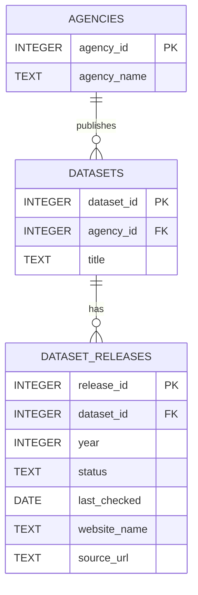

# relational diagram

- `DATASETS` stores the stable identity of a dataset. 
- `DATASET_RELEASES` stores each yearly release, including its current preservation status and verification details.
    - `release_id` would be a UTC key.
